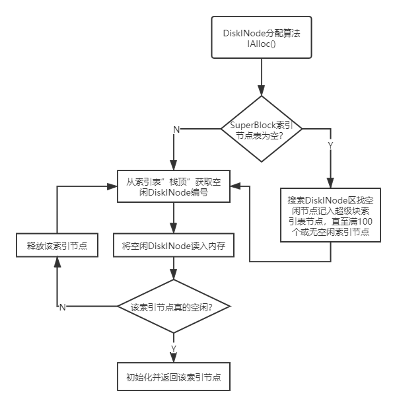
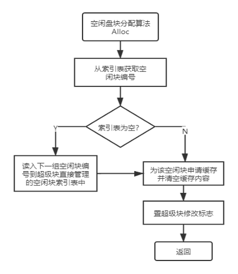
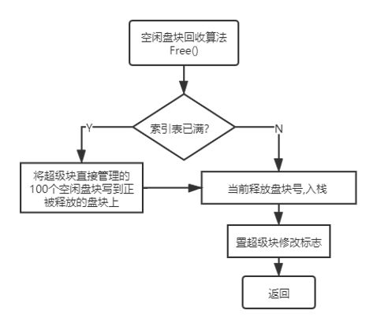
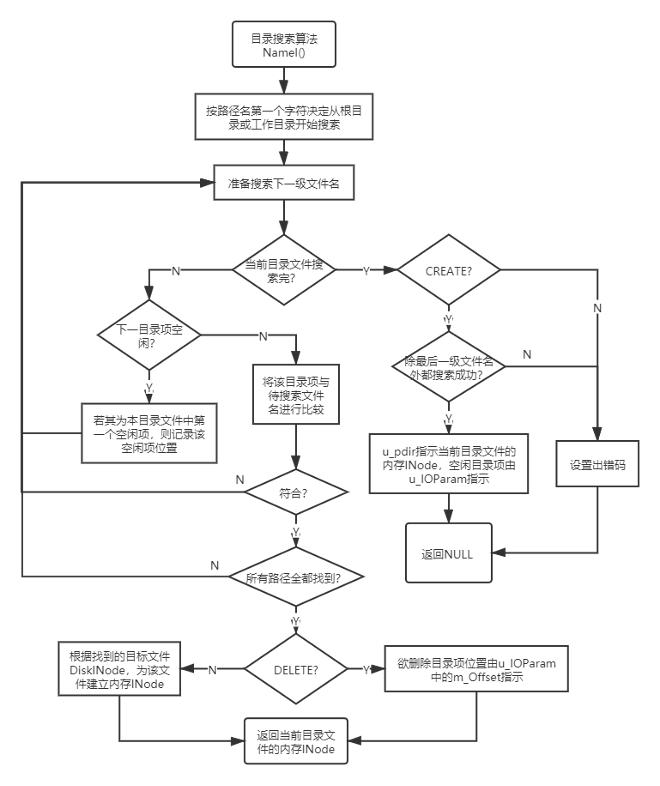
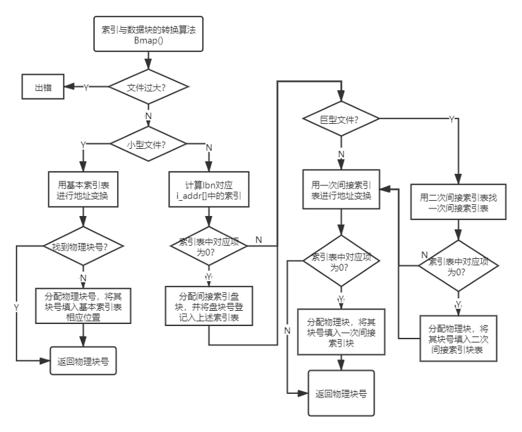

# Unix-Filesystem-Project

## 1. Introduction

This is a Unix-like file system, along with a corresponding command-line interface.

The project entails the specific implementation of the following components:

### 1.1 Unix V6++ Disk

- Utilize a standard large file (such as `C:\myDisk.img`) to emulate the disk of Unix V6++

### 1.2 Disk File Structure

- Structure and size of the SuperBlock
- Structure of the Disk Inode, including the index structure
- Design and implementation of the allocation algorithm for Disk Inode
- Design and implementation of the allocation algorithm for the file data

### 1.3 File Directory Structure

- Structure of the directory file
- Design of directory retrieval algorithm
- Design for adding, deleting, and modifying the directory structure

### 1.4 File Open Structure

- File open structure
- Structure of the in-memory Inode
- Design and implementation of the allocation algorithm for in-memory Inode
- File opening process

### 1.5 File System

- Implementation of file read and write operations
- Implementation of other file operations

### 1.6 Disk Cache

- Structure of cache control blocks
- Structure of cache queues
- Design and implementation of the allocation algorithm for cache queues
- Implementation of read and write operations on the file using the cache

## 2. Functionality 

|                 Command                 |                         Description                          |
| :-------------------------------------: | :----------------------------------------------------------: |
|                  help                   |            Display an overview of functionalities            |
|                 fformat                 |                    Format the file volume                    |
|                   ls                    |          List the contents of the current directory          |
|           mkdir &lt;dirname>            |                     Make a new directory                     |
|             cd &lt;dirname>             |                 Change the present directory                 |
|          fcreate &lt;filename>          |                        Create a file                         |
|          fdelete &lt;filename>          |                        Delete a file                         |
|           fopen &lt;filename>           |                        Open the file                         |
|             fclose &lt;fd>              |                        Close the file                        |
|        fread &lt;fd> &lt;nbytes>        | Read nbytes from the file, starting from the current file pointer |
|  fwrite &lt;fd> &lt;nbytes>&lt;string>  | Write nbytes of the string to the file at the current file pointer position |
| flseek &lt;fd> &lt;offset> &lt;ptrname> | Move the file pointer of the file by offset bytes in the direction specified by ptrname |
|        cp &lt;file1> &lt;file2>         |             Copy the contents of file1 to file2              |
|           ftree &lt;dirname>            |                  Display the directory tree                  |
|                   pwd                   |                   Display the current path                   |
|      Frename &lt;file1> &lt;file2>      |                    Rename file1 to file2                     |
|                  Exit                   |                 Exit the current file system                 |

## 3. Data Struture Design

### 3.1 Disk file structure 

The disk file structure defined in this project is consistent with the disk file structure of Unix V6++. The structure, as shown in the picture below, includes the SuperBlock, Disk Inode blocks, and file data blocks.


- SuperBlock

  Unix V6++ employs different management algorithms for various regions of the entire disk storage space, and all relevant information is stored in the SuperBlock. 

  ```cpp
  class SuperBlock
  {
  public:
  	SuperBlock() {};
  	~SuperBlock() {};
  public:
  	const static int MAX_NUMBER_FREE = 100;
  	const static int MAX_NUMBER_INODE = 100;
  public:
  	int		s_isize;					/* 外存Inode区占用的盘块数 */
  	int		s_fsize;					/* 盘块总数 */
  
  	int		s_nfree;					/* 直接管理的空闲盘块数量 */
  	int		s_free[MAX_NUMBER_FREE];	/* 直接管理的空闲盘块索引表 */
  
  	int		s_ninode;					/* 直接管理的空闲外存Inode数量 */
  	int		s_inode[MAX_NUMBER_INODE];	/* 直接管理的空闲外存Inode索引表 */
  
  	int		s_fmod;						/* 内存中super block副本被修改标志，意味着需要更新外存对应的Super Block */
  	int		padding[51];				/* 填充使SuperBlock块大小等于1024字节，占据2个扇区 */
  };
  
  ```

- DiskInode

  DiskInode, serving as the external storage inode, is the region where file index information is stored. It is stored on the disk in a static form.

  ```cpp
  class DiskInode
  {
  public:
  	DiskInode() {};
  	~DiskInode() {};
  public:
  	unsigned int d_mode;	/* 状态的标志位，定义见enum INodeFlag */
  	int		d_nlink;		/* 文件联结计数，即该文件在目录树中不同路径名的数量 */
  	int		d_size;			/* 文件大小，字节为单位 */
  	int		d_addr[10];		/* 用于文件逻辑块号和物理块号转换的基本索引表 */
  	int		padding[3];		/* 填充使得DiskInode类占64个字节 */   
  };
  
  ```

- File index structure

  Unix V6++ adopts a mixed index structure, classifying files into small, large, and huge based on size. Small files use a direct indexing method, occupying up to 6 data blocks; large files use a single indirect indexing method, occupying up to 6 + 2\*128 data blocks; huge files use a double indirect indexing method, occupying up to 6 + 2*128 + 2\*128\*128 data blocks.

  ```cpp
  static const int BLOCK_SIZE = 512;		/* 文件逻辑块大小: 512字节 */
  static const int ADDRESS_PER_INDEX_BLOCK = BLOCK_SIZE / sizeof(int);	/* 每个间接索引表(或索引块)包含的物理盘块号 */
  
  static const int SMALL_FILE_BLOCK = 6;	/* 小型文件：直接索引表最多可寻址的逻辑块号 */
  static const int LARGE_FILE_BLOCK = 128 * 2 + 6;	/* 大型文件：经一次间接索引表最多可寻址的逻辑块号 */
  static const int HUGE_FILE_BLOCK = 128 * 128 * 2 + 128 * 2 + 6;	/* 巨型文件：经二次间接索引最大可寻址文件逻辑块号 */
  
  static const int PIPSIZ = SMALL_FILE_BLOCK * BLOCK_SIZE;
  
  ```

### 3.2 Directory structure

```cpp
class DirectoryEntry
{
public:
	static const int DIRSIZ = 28;	/* 目录项中路径部分的最大字符串长度 */
public:
	DirectoryEntry() {};
	~DirectoryEntry() {};
public:
	int inode;		        /* 目录项中Inode编号部分 */
	char name[DIRSIZ];	    /* 目录项中路径名部分 */
};

```

### 3.3 File open structure 

If every access to a file requires disk lookup, the file system becomes highly inefficient. To enhance the efficiency of the file system, I establish an efficient file management structure in memory, known as the file open structure. 

The file open structure comprises the following five data structures: INode, InodeTable, File, OpenFileTable, and OpenFiles. Their logical relationships are illustrated in the picture below


-  INode

  ```cpp
  class Inode
  {
  public:
  	Inode();
  	~Inode() {};
  	void ReadI();                   /* 根据Inode对象中的物理磁盘块索引表，读取相应的文件数据 */
  	void WriteI();                  /* 根据Inode对象中的物理磁盘块索引表，将数据写入文件 */
  	int Bmap(int lbn);              /* 将文件的逻辑块号转换成对应的物理盘块号 */
  	void IUpdate();                 /* 更新外存Inode的最后的访问时间、修改时间 */
  	void ITrunc();                  /* 释放Inode对应文件占用的磁盘块 */
  	void Clean();                   /* 清空Inode对象中的数据 */
  	void ICopy(Buf*, int);          /* 将包含外存Inode字符块中信息拷贝到内存Inode中 */
  public:
  	unsigned int i_flag;	/* 状态的标志位，定义见enum INodeFlag */
  	unsigned int i_mode;	/* 文件工作方式信息 */
  	int		i_count;		/* 引用计数 */
  	int		i_nlink;		/* 文件联结计数，即该文件在目录树中不同路径名的数量 */
  	int		i_number;		/* 外存inode区中的编号 */
  	int		i_size;			/* 文件大小，字节为单位 */
  	int		i_addr[10];		/* 用于文件逻辑块号和物理块号转换的基本索引表 */
  };
  
  ```

- InodeTable

  The InodeTable is used to manage in-memory INode, establishing the association between in-memory INode and DiskINode.

  ```cpp
  class InodeTable
  {
  public:
  	static const int NINODE = 100;	/* 内存Inode的数量 */
  public:
  	InodeTable();
  	~InodeTable();
  	Inode* IGet(int inumber); /* 根据外存Inode编号获取对应Inode */
  	void IPut(Inode* pNode);  /* 减少该内存Inode的引用计数，如果此Inode已经没有目录项指向它，且无进程引用该Inode，则释放此文件占用的磁盘块 */
  	void UpdateInodeTable();  /* 将所有被修改过的内存Inode更新到对应外存Inode中 */
  	int IsLoaded(int inumber); /* 检查编号为inumber的外存inode是否有内存拷贝。如果有则返回该内存Inode在内存Inode表中的索引 */
  	Inode* GetFreeInode();     /* 在内存Inode表中寻找一个空闲的内存Inode */
  public:
  	Inode m_Inode[NINODE];		/* 内存Inode数组，每个打开文件都会占用一个内存Inode */
  };
  
  ```

- File

  A file can be opened by one or multiple processes simultaneously, using the same or different path names, and with different operational requirements. However, the in-memory INode does not store this information. Therefore, a class is established to record information related to file openings. This structure keeps track of the read and write request types of the processes opening the file, as well as the file's read and write positions.

  ```cpp
  class File
  {
  public:
  	enum FileFlags
  	{
  		FREAD = 0x1,			/* 读请求类型 */
  		FWRITE = 0x2,			/* 写请求类型 */
  		FPIPE = 0x4				/* 管道类型 */
  	};
  public:
  	File();
  	~File();
  	unsigned int f_flag;		/* 对打开文件的读、写操作要求 */
  	int		f_count;			/* 当前引用该文件控制块的进程数量 */
  	Inode* f_inode;			    /* 指向打开文件的内存Inode指针 */
  	int		f_offset;			/* 文件读写位置指针 */
  };
  
  ```

- OpenFileTable

  It is an array of type File, where each entry in the array is a File control block.

  ```cpp
  class OpenFileTable
  {
  public:
  	static const int NFILE = 100;	/* 打开文件控制块File结构的数量 */
  public:
  	OpenFileTable() {};
  	~OpenFileTable() {};
  	File* FAlloc();            /* 在系统打开文件表中分配一个空闲的File结构 */
  	void CloseF(File* pFile); /* 对打开文件控制块File结构的引用计数f_count减1. 若引用计数f_count为0，则释放File结构*/
  public:
  	File m_File[NFILE];			/* 系统打开文件表 */
  };
  
  ```

### 3.4 Cache structure

Through the high-speed cache structure, it is possible to reduce the number of disk reads and writes, enhancing the efficiency of the file system. I have designated a cache control block for each cache—Buf class. Simultaneously, the BufferManager class is responsible for implementing the principles of high-speed caching. 

- Buf

  Buf class records information about the usage of the corresponding cache, and it also doubles as an I/O request block, documenting the I/O requests and their execution results associated with that cache.

  ```cpp
  class Buf     /* 省略了用于标志设备和IO出错时的成员变量 */
  {
  public:
  	enum BufFlag	/* b_flags中标志位 */
  	{
  		B_WRITE = 0x1,		/* 写操作。将缓存中的信息写到硬盘上去 */
  		B_READ = 0x2,		/* 读操作。从盘读取信息到缓存中 */
  		B_DONE = 0x4,		/* I/O操作结束 */
  		B_ERROR = 0x8,		/* I/O因出错而终止 */
  		B_BUSY = 0x10,		/* 相应缓存正在使用中 */
  		B_WANTED = 0x20,	/* 有进程正在等待使用该buf管理的资源，清B_BUSY标志时，要唤醒这种进程 */
  		B_ASYNC = 0x40,		/* 异步I/O，不需要等待其结束 */
  		B_DELWRI = 0x80		/* 延迟写，在相应缓存要移做他用时，再将其内容写到相应块设备上 */
  	};
  public:
  	unsigned int b_flags;	/* 缓存控制块标志位 */
  	/* 缓存控制块队列勾连指针 */
  	Buf* b_forw;			
  	Buf* b_back;		
  	Buf* av_forw;		
  	Buf* av_back;		
  	int		b_wcount;		/* 需传送的字节数 */
  	char* b_addr;	        /* 指向该缓存控制块所管理的缓冲区的首地址 */  //unsigned char*
  	int		b_blkno;		/* 磁盘逻辑块号 */
  };
  
  ```

- BufferManager

  This class is primarily responsible for managing the high-speed cache blocks in the kernel. It includes the configuration of the size and number of high-speed cache blocks, and provides information about the head of the free queue and the head of the device queue.

  ```cpp
  class BufferManager
  {
  public:
  	/* static const member */
  	static const int NBUF = 15;			/* 缓存控制块、缓冲区的数量 */
  	static const int BUFFER_SIZE = 512;	/* 缓冲区大小。 以字节为单位 */
  public:
  	BufferManager();
  	~BufferManager();
  	//void Initialize();					/* 缓存控制块队列的初始化。将缓存控制块中b_addr指向相应缓冲区首地址。*/
  	Buf* GetBlk(int blkno);	            /* 申请一块缓存，用于读写字符块blkno。*/
  	void Brelse(Buf* bp);				/* 释放缓存控制块buf */
  	Buf* Bread(int blkno);	            /* 读一个磁盘块，blkno为目标磁盘块逻辑块号。 */
  	void Bwrite(Buf* bp);				/* 写一个磁盘块 */
  	void Bdwrite(Buf* bp);				/* 延迟写磁盘块 */
  	void Bawrite(Buf* bp);				/* 异步写磁盘块 */
  	void ClrBuf(Buf* bp);				/* 清空缓冲区内容 */
  	void Bflush();				        /* 将dev指定设备队列中延迟写的缓存全部输出到磁盘 */
  private:
  	void NotAvail(Buf* bp);				/* 从自由队列中摘下指定的缓存控制块buf */
  private:
  	Buf bFreeList;						/* 自由缓存队列控制块，定义有自由队列队头*/
  	Buf m_Buf[NBUF];					/* 缓存控制块数组 */
  	Buf bDevtab;                        /* 设备控制块，定义有设备队列队头 */   //新增成员变量
  	char Buffer[NBUF][BUFFER_SIZE];	    /* 缓冲区数组 */     //unsigned char
  };
  
  ```

## 4. Module invocation relationships


## 5. Key function algorithm design

### 5.1 DiskINode allocation algorithm: FileSystem::IAlloc() 

The free DiskINode is managed in a stack, following a last-in, first-out (LIFO) approach. If the stack is not empty, a free DiskINode is allocated directly. If the stack is empty, the DiskINode area is traversed, and any found free nodes are pushed onto the stack.



### 5.2 DiskINode deallocation algorithm: FileSystem::IFree() 

Free DiskINodes are managed in a stack fashion. When it is necessary to release a DiskINode, if the number of free DiskINodes in the SuperBlock's Inode table is less than 100, the index of the Inode is recorded at the "top" of the stack. Otherwise, it returns directly without any further operation.

### 5.3 Free disk block allocation algorithm: FileSystem::Alloc() 

Free disk blocks are managed using a stack and a grouped chained indexing method. The SuperBlock can directly manage a maximum of 100 free blocks (the first group). The index tables for free disk blocks in each group of the SuperBlock are stored in the first block's first 101 bytes of their previous group. When allocating a free disk block, the content at the current stack top is popped out. If the current stack only has one index left, the next group is read in for management.



### 5.4 Free disk block deallocation algorithm: FileSystem::Free()

Free disk blocks are managed using a stack and a grouped chained indexing method. During the recovery process, if the current stack is not full, the index is directly pushed onto the stack. If the current stack is full, a new group of free blocks is added to the end of this group.

 

### 5.5 Directory search algorithm: FileManager::NameI() 

Split the user-provided pathname string, and process each segment of the pathname one at a time. For each split path segment, individually search for matching directory entries, thereby converting the pathname into the corresponding file's inode.



### 5.6 File index to file data block mapping algorithm: Inode::Bmap() 

Firstly, determine the file size. If it is a small file, directly retrieve data block indices from the index table. If it is a medium-sized file, retrieve a first-level indirect index table based on the index table, and then obtain data block indices from the first-level indirect index table. If it is a large file, retrieve a second-level indirect index table based on the index table, then obtain a first-level indirect index table through the second-level indirect index table, and finally obtain data block indices.



### 5.7 High-speed cache allocation algorithm

In the project, a doubly linked circular list is utilized to simulate the cache queue. The core idea of the high-speed cache allocation algorithm is as follows: First, search for the target cache block in the device queue. If it exists, detach the cache node and return it. If it does not exist, indicating that there is no target cache block in the device queue, the first node from the free queue is detached and removed from the free queue. If the cache block has a delayed write flag, it should be immediately written back.

### 5.8 High-speed cache eviction algorithm

In the project, the Least Recently Used (LRU) cache eviction algorithm is employed. Its core idea is as follows: When a cache is released, it is inserted at the tail of the free queue. This approach aims to keep the cache block unchanged for as long as possible. When there is a demand to use a cache block in its original state from the free queue, it is immediately removed. Otherwise, a cache block is taken from the head of the free queue when cache allocation is needed.
